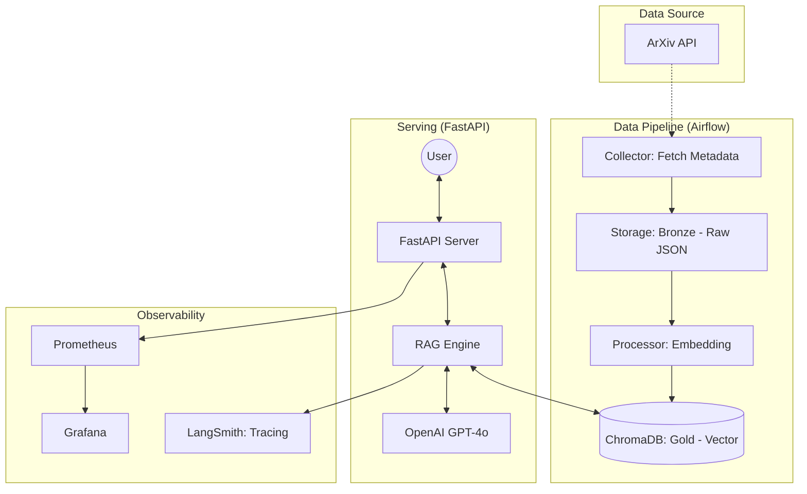

# Daily ArXiv Insights Ops

> Production-Ready LLMOps Pipeline for Automated Research Paper Analysis

매일 업데이트되는 ArXiv의 최신 AI 논문 데이터를 자동으로 수집, 가공하고 RAG(Retrieval-Augmented Generation)를 통해 지식화하는 End-to-End LLMOps 파이프라인입니다. 단순한 기능 구현을 넘어, 데이터의 정합성 유지와 시스템 관찰 가능성(Observability) 확보에 초점을 맞췄습니다.

### System Architecture
전체 시스템은 마이크로서비스 구조로 설계되었으며, 데이터의 흐름은 수집(ETL) → 저장(Vector DB) → 서비스(RAG API) → 모니터링(Tracing) 순으로 유기적으로 연결됩니다.



### Key Features
1. 데이터 오케스트레이션 (Airflow)
    - Automated ETL: 매일 정해진 시간에 최신 논문을 수집하고 전처리하여 Vector DB를 업데이트
    - Medallion Architecture: 원본 데이터를 JSON 파일로 보존(Bronze)하고 가공된 벡터 데이터를 별도 저장(Gold)하여 데이터 재현성(Reproducibility)을 확보했습니다.
2. Scalable RAG Service (FastAPI)
    - Retrieval Optimization: ChromaDB와 Sentence-Transformer를 활용해 대규모 텍스트 데이터에서 유의미한 맥락을 빠르게 추출합니다.
    - Async API: FastAPI의 비동기 처리를 통해 다중 요청에 대한 서빙 효율성을 극대화했습니다.
3. Full-stack Observability
    - 
4. CI/CD & Infrastructure
    - 

```
arxiv-ops-pilot/
├── README.md               # 프로젝트의 '얼굴' (High-level 개요 및 핵심 성과)
├── docs/                   # 세부 기술 문서 (Deep-dive 내용)
│   ├── 01_architecture.md  # 시스템 설계 및 데이터 흐름 상세
│   ├── 02_data_pipeline.md # Airflow를 활용한 ETL/인덱싱 자동화 상세
│   ├── 03_observability.md # Grafana, LangSmith 모니터링 전략
│   └── 04_ci_cd.md         # GitHub Actions 및 Docker 이미지 빌드 전략
└── (기존 폴더들: src, dags, infra, data...)
```


```
cd /home/wsm/workspace/daily-arxiv-insights-ops
.venv/bin/uvicorn src.api:app --reload --host 0.0.0.0 --port 8000
```

```
docker compose up -d --build
docker compose logs airflow-scheduler | grep -i error
```